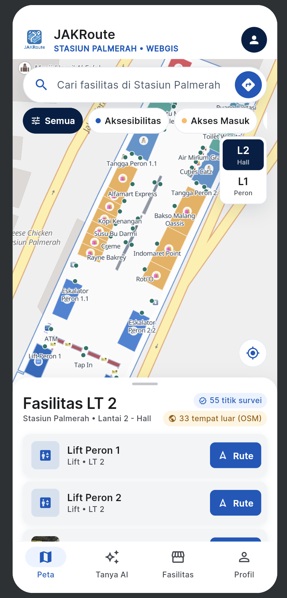
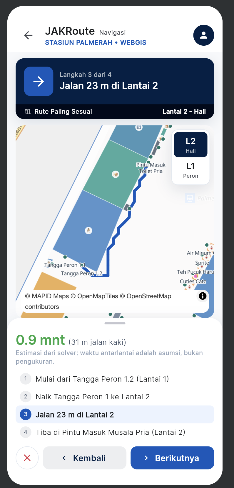
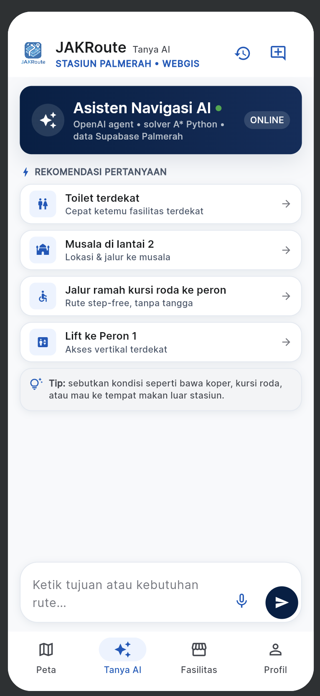
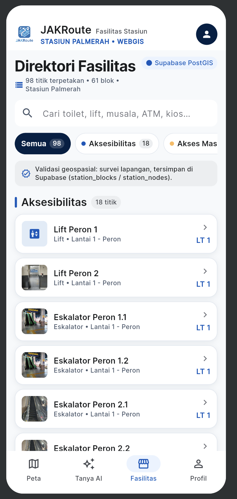
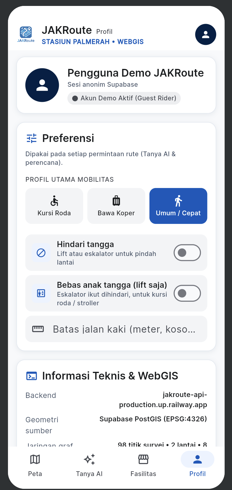
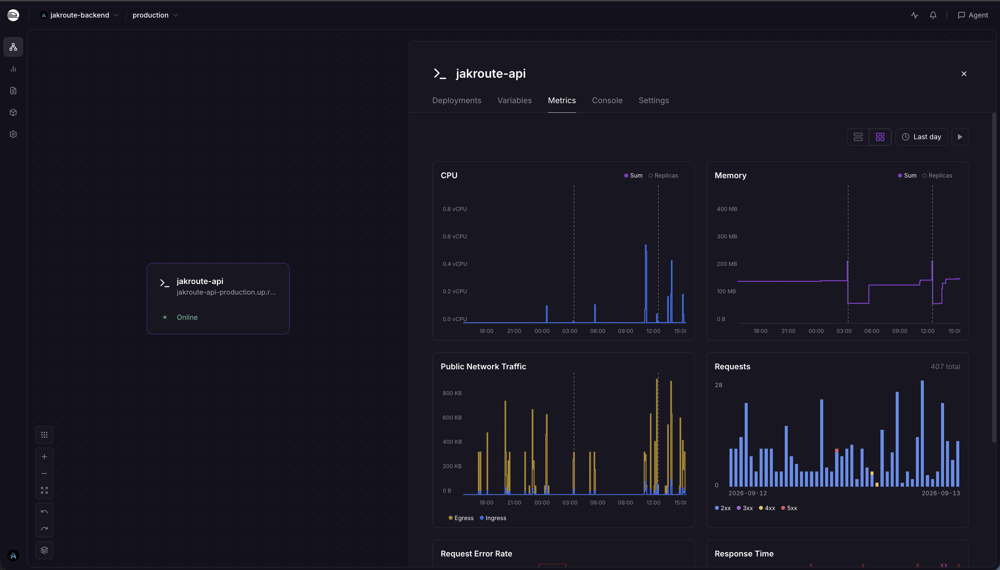
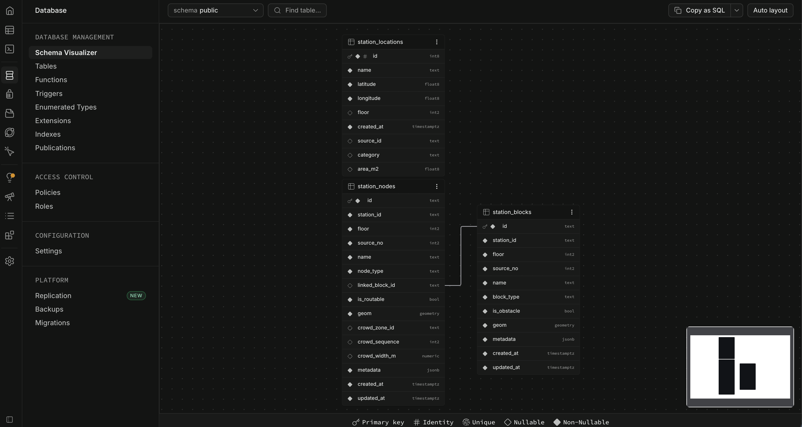

# JAKRoute

Indoor + outdoor wayfinding untuk Stasiun Palmerah — akurat hingga level peron, dibangun untuk **MAPID WebGIS Competition 2026**.

[](https://jakroute.vercel.app)
[](https://jakroute-api-production.up.railway.app)
[](https://flutter.dev)
[](https://fastapi.tiangolo.com)
[](https://supabase.com)

**[jakroute.vercel.app](https://jakroute.vercel.app)** — masuk pakai "Masuk Cepat" (akun demo, tanpa registrasi).


<!-- ganti file di atas + baris ini jadi docs/screenshots/poster.png begitu poster asli siap -->


## Ringkasan

Navigasi indoor stasiun kereta itu susah bukan karena petanya tidak ada, tapi karena
peta yang ada (denah dinding, Google Maps) berhenti tepat di pintu masuk. JAKRoute
mengambil alih dari situ: sekali masuk stasiun, sistem tahu di mana lift, tangga,
toilet difabel, dan peron berada — lalu merutekan pejalan kaki lantai-per-lantai
dengan mempertimbangkan kepadatan dan preferensi aksesibilitas mereka.

Studi kasus: **Stasiun Palmerah**, dua lantai (peron dan hall), disurvei langsung di
lapangan (30 Agustus 2026) — bukan denah generik. Data luar stasiun (minimarket,
masjid, halte) memakai OpenStreetMap dan diberi label jelas sebagai data komunitas,
bukan hasil survei.

## Fitur

- **Tiga mode rute** — `Rute Minim Berjalan Kaki`, `Rute Paling Cepat`, dan
  `Rute Paling Sesuai`, dihitung dari graf grid A* 8-arah dengan pencarian
  Pareto-label multi-kriteria (waktu, jarak, kepadatan).
- **Peta indoor interaktif** — maplibre-gl per lantai, tap fasilitas/polygon untuk
  detail, lokasi perangkat asli via Geolocation API, tombol "lokasi saya", dan
  highlight segmen rute aktif saat navigasi step-by-step.
- **Preferensi aksesibilitas** — step-free/lift only dan hindari tangga; rute yang
  tidak memenuhi batasan dikeluarkan sepenuhnya, bukan disortir ke bawah.
- **Kepadatan simulasi** — 100 titik crowd berbobot di koridor tertentu, ditandai
  jelas sebagai simulasi (bukan data GPS agregat nyata) di setiap tempat ia muncul.
- **Direktori fasilitas** per lantai, lengkap foto survei lapangan.
- **Tanya AI** — asisten chat untuk pertanyaan rute/fasilitas dalam bahasa natural,
  dengan riwayat percakapan tersimpan per akun (Supabase) dan input suara (Web
  Speech API).
- **Auth Supabase** — akun demo anonim (untuk juri/pengujian cepat) atau akun email
  asli, keduanya mendapat sesi nyata dan riwayat tersimpan per akun.
- **Peringatan cuaca** pada segmen outdoor, dan peringatan eksplisit saat akses
  antarlantai sedang rusak/dilaporkan tidak bisa dipakai.

## Screens

<p align="center">
  
  
  
  
  
</p>
<p align="center"><sub>Peta indoor · Navigasi rute · Tanya AI · Fasilitas · Profil</sub></p>

## Arsitektur

```
JAKRoute/
├── lib/jakroute/          # Flutter web frontend
│   ├── ui/                # Layar: peta, chat, fasilitas, profil, onboarding
│   ├── station_map.dart   # Binding JS maplibre-gl (dart:js_interop, tanpa plugin)
│   ├── route_steps.dart   # Konversi geometri rute → instruksi turn-by-turn
│   ├── speech_input.dart  # Binding Web Speech API untuk Tanya AI
│   └── chat_history.dart  # Persistensi riwayat chat ke Supabase
├── backend/jakroute/      # FastAPI backend
│   ├── indoor_routing.py  # A* grid 8-arah + Pareto multi-kriteria
│   ├── service.py         # Orkestrasi: rute, cuaca, forum insiden, AI insight
│   └── station_source.py  # Loader data stasiun (Supabase PostGIS)
└── supabase/              # Migrasi SQL (station_blocks, station_nodes, chat_history)
```

**Alur data**: Supabase PostGIS menyimpan denah (`station_blocks`, obstacle polygon)
dan titik routable (`station_nodes`, anchor graf) → backend FastAPI membangun graf
dan melayani `/recommend-route` → Flutter merender geometri hasil di atas peta
maplibre-gl, per lantai.

### Endpoint API

| Endpoint | Metode | Fungsi |
|---|---|---|
| `/catalog` | GET | Data stasiun: fasilitas, lantai, connector |
| `/recommend-route` | POST | Tiga alternatif rute + alasan + peringatan |
| `/crowd/snapshot` | GET | Snapshot kepadatan simulasi saat ini |
| `/forum/summary`, `/forum/reports`, `/forum/confirm` | GET/POST | Laporan insiden akses (lift/eskalator rusak) |
| `/health` | GET | Health check |

### Deployment & skema data

<p align="center">
  
  
</p>
<p align="center"><sub>Backend di Railway (jakroute-api) · Skema Supabase PostGIS (station_locations, station_nodes, station_blocks)</sub></p>

## Menjalankan secara lokal

Prasyarat: Flutter 3.11+, Python 3.12+, akun Supabase (untuk data stasiun + auth).

**Backend:**

```bash
cd backend
python -m venv venv && source venv/bin/activate   # Windows: venv\Scripts\activate
pip install -r requirements.txt
cp .env.example .env   # isi SUPABASE_URL, SUPABASE_ANON_KEY, dll.
python -m uvicorn main:app --reload --port 8000
```

Migrasi database (jalankan sekali via Supabase SQL Editor, berurutan):
`supabase/01_station_blocks.sql` → `supabase/02_station_nodes.sql` → `supabase/03_chat_history.sql`.

**Frontend:**

```bash
flutter pub get
flutter run -d chrome \
  --dart-define=BACKEND_URL=http://localhost:8000 \
  --dart-define=SUPABASE_URL=https://xxx.supabase.co \
  --dart-define=SUPABASE_ANON_KEY=xxx
```

Detail lebih lanjut (mode data demo vs. Supabase, provider cuaca/AI opsional, deploy
Docker) ada di [JAKROUTE_README.md](JAKROUTE_README.md) dan `docs/`.

## Status proyek

Batas sistem saat ini: routing pejalan kaki outdoor + indoor satu stasiun (Palmerah).
Belum ada routing/jadwal antarstasiun KRL, tidak ada GPS indoor nyata (posisi di
peta pakai lokasi GPS perangkat asli, bukan indoor positioning), dan data kepadatan
adalah simulasi reproducible — bukan agregasi GPS pengguna nyata. Semua batasan ini
dilabeli jelas di UI, bukan disamarkan sebagai data live.

## Tim

Dibangun untuk MAPID WebGIS Competition 2026 oleh tim 5 orang.
Repo: [aarieffawwaz/JAKRoute](https://github.com/aarieffawwaz/JAKRoute) ·
[owenputra6/JAKRoute](https://github.com/owenputra6/JAKRoute)
